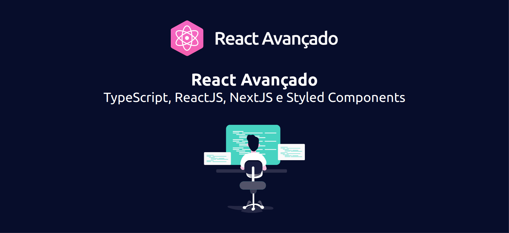

<h1 align="center">
  
</h1>

<h2 align="center">React Avançado</h2>

  
  
  
  
  
  
  

  <a href="#project">Projeto</a>
  &nbsp;&nbsp;&nbsp;|&nbsp;&nbsp;&nbsp;
  <a href="#requisites">Requisitos</a>
  &nbsp;&nbsp;&nbsp;|&nbsp;&nbsp;&nbsp;
  <a href="#techs">Tecnologias</a>
  &nbsp;&nbsp;&nbsp;|&nbsp;&nbsp;&nbsp;
  <a href="#clone">Clonando</a>
  &nbsp;&nbsp;&nbsp;|&nbsp;&nbsp;&nbsp;
  <a href="#commands">Comandos</a>
  &nbsp;&nbsp;&nbsp;|&nbsp;&nbsp;&nbsp;
  <a href="#contribute">Contribuindo</a>
  &nbsp;&nbsp;&nbsp;|&nbsp;&nbsp;&nbsp;
  <a href="#license">Licença</a>

 

  

 

<h1>
  
  📦 Projeto
</h1>

Boilerplate construido valendo-se de conhecimentos abstraído da comunidade Dev React.

 

  <a href="#readme" title="Voltar ao topo">⬆ Voltar ao topo</a>

 

<h1>
  
  ⚡ Tecnologias
</h1>

Tecnologias do projeto:

- [Node.js](https://nodejs.org)
- [Next.js](https://nextjs.org)
- [ReactJS](https://reactjs.org)
- [TypeScript](https://www.typescriptlang.org/)
- [Styled Components](https://styled-components.com)
- [Jest](https://jestjs.io)
- [React Testing Library](https://testing-library.com/docs/react-testing-library/intro)
- [Storybook](https://storybook.js.org)
- [ESLint](https://eslint.org)
- [Prettier](https://prettier.io)
- [Husky](https://typicode.github.io/husky)
- [Next PWA](https://github.com/shadowwalker/next-pwa)

 

  <a href="#readme" title="Voltar ao topo">⬆ Voltar ao topo</a>

 

<h1>
  
  ⌨️ Comandos
</h1>

    "test:ci": "jest --runInBand",
    "generate": "yarn plop --plopfile generators/plopfile.ts",
    "storybook": "start-storybook -s public -p 6006",
    "build-storybook": "build-storybook -s public",
    "postinstall": "husky install",
    "prepare": "husky install"
- `dev`: executa a aplicação no endereço `localhost:3000`
- `build`: constrói a versão da aplicação otimizada para produção
- `start`: inicia um servidor simples da aplicação com a versão otimizada para produção
- `lint`: executa o Linter em todos as páginas e componentes da aplicação
- `test`: utiliza o Jest para testar todos as páginas e componentes da aplicação
- `test:watch`: executa o Jest em "watch mode"
- `storybook`: executa o Storybook no endereço `localhost:6006`
- `build-storybook`: constrói a versão do Storybook otimizada para produção
- `generate`: cria pasta para um novo componente baseado em um pattern pré estabelecido

 

  <a href="#readme" title="Voltar ao topo">⬆ Voltar ao topo</a>

 

<h1>
  
  📄 Licença
</h1>

Esse projeto encontra-se sob a licença MIT.
Para mais detalhes, consulte o arquivo [LICENSE](LICENSE.md).

 

  <a href="#readme" title="Voltar ao topo">⬆ Voltar ao topo</a>

---

 

  
  &nbsp;&nbsp;&nbsp;&nbsp;&nbsp;&nbsp;
  

